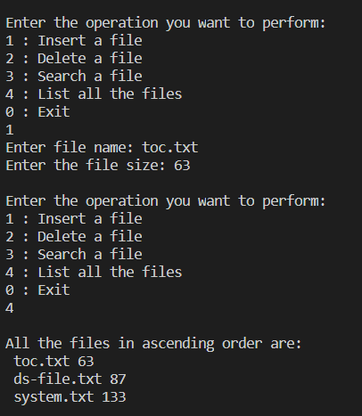
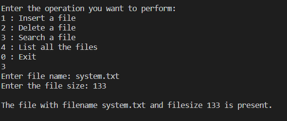
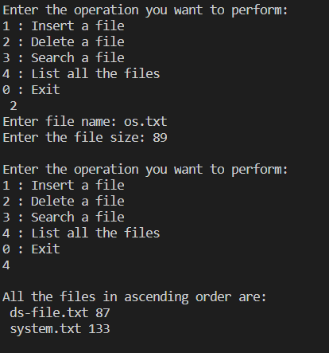
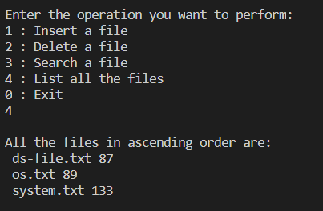

### Data Structure Term Project
#### File structure implementation using Btree
A file structure hierarchy has been implemented using BTree data structure. In the project we created two classes File and OS in order to simulate a file hierarchy.
These are the operations performed on the datastructure :
* Insert  
* Search 
* Delete 
* Traverse 
